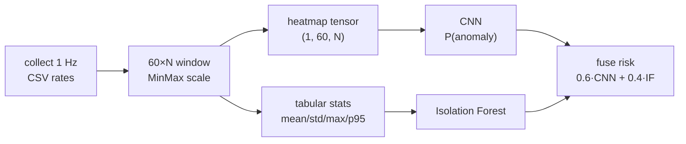

# SysSpectogram

[English](README.md) · [Русский](README_RU.md)

Linux **VPS / host defense** utility: behavioral ML on metric “spectrograms” (CNN + Isolation Forest), perimeter/egress watching, Telegram SOAR-lite, live web / Mini App, and a **v3 Rust integrity agent** (process / path / module signals + lightweight metrics).

**Scope (v0.9):** v0.8 supply-chain plus pickle-free model artifacts, remote alert sinks, default FIM baselines, hybrid watchdog (Phoenix + optional DKMS), and clearer Day-0 docs. Live **VMI** remains **v1.0** ([docs/VMI.md](docs/VMI.md)).

### Docs (by topic)

**Deploy & configure:** [Configure](docs/CONFIGURE.md) · [Cold install](docs/COLD_INSTALL.md) · [Configuration](docs/CONFIG.md) · [Day-0](docs/DAY0_VPS.md) · [Golden path](docs/GOLDEN_PATH.md) · [Profiles](docs/PROFILES.md)

**Defense components:** [Agent](docs/AGENT.md) · [Agent protect](docs/AGENT_PROTECT.md) · [Root watch](docs/ROOT_WATCH.md) · [eBPF](docs/EBPF_SETUP.md) · [Kirk](docs/KIRK.md) · [Threat model](docs/THREAT_MODEL.md) · [VMI](docs/VMI.md) · [Supply chain](docs/SUPPLY_CHAIN.md) · [Supply chain story](docs/SUPPLY_CHAIN_STORY.md)

**Control surfaces:** [Telegram](docs/TELEGRAM.md) · [Live web / Mini App](docs/WEBAPP.md) · [Sessions](docs/SESSIONS.md) · [Feedback](docs/FEEDBACK.md)

**Data / ML ops:** [Recipes](docs/RECIPES.md) · [Train bridge](docs/TRAIN_BRIDGE.md) · [Eval](docs/EVAL.md) · [Role lab](docs/ROLE_LAB.md) · [Simulations](simulations/README.md)

**Roadmap & releases:** [Roadmap](docs/ROADMAP_QUALITY.md) · [Release v0.9](docs/RELEASE_v0.9.0.md) · [Release v0.8](docs/RELEASE_v0.8.0.md)

### What's new in v0.9

| Piece | Status |
| --- | --- |
| Pickle-free `scaler.json` + `iforest.ssf.npz` (joblib runtime removed) | yes |
| Alert fan-out: file / syslog / HTTPS | yes |
| FIM baseline on disk; enabled on `lite` profile | yes |
| Hybrid watchdog: Phoenix harden + optional DKMS `sysspectogram_wd` | yes (kmod opt-in) |
| Narrow `kirk.auto_isolate_host_risk` (default off) | yes |
| Grouped README docs + ONNX VPS path + agent operator notes | yes |

### Limitations (honest)

Same-host root can still stop services and wipe local logs. Remote alert sinks and signed manifests reduce silence/subversion; they do **not** make the tool unkillable. Optional kernel helper is off by default and often unavailable on locked-down cloud kernels. See [SECURITY.md](SECURITY.md).

### VPS inference path (ONNX, no Torch)

```bash
# On a builder (with Torch):
python -m sysspectogram train --dataset dataset/out --out artifacts/live
python -m sysspectogram export-onnx --model artifacts/live
# optional: migrate legacy joblib → safe formats
python -m sysspectogram artifacts migrate --model artifacts/live

# On the VPS: prefer ONNX runtime (or notorch without CNN)
# configs/default.yaml → runtime.prefer: onnx
# or: export SYSSPECTOGRAM_RUNTIME=onnx
python -m sysspectogram guard --model artifacts/live --telegram --dry-run
```

`cnn.onnx` is the recommended VPS CNN artifact; `cnn.pt` is for builder / `runtime: torch_ml`. Details: [TRAIN_BRIDGE.md](docs/TRAIN_BRIDGE.md), [CONFIG.md](docs/CONFIG.md).

### What's new in v0.8 (carried)

| Piece | Status |
| --- | --- |
| Minisign + `artifacts.manifest.json` (SHA-256) | yes — [SUPPLY_CHAIN.md](docs/SUPPLY_CHAIN.md) |
| Deterministic SPDX 2.3 SBOM | yes |
| Opt-in `supply_chain.enforce` | yes |
| Safe `cnn.pt` load (`weights_only=True`) | yes |
| AUR + Debian packaging recipes | yes — `packaging/` |

```bash
source .venv/bin/activate
# Day-0: terminal configure UI (Rich menu in THIS terminal — not a browser)
python -m sysspectogram configure
# or non-interactive:
# python -m sysspectogram configure --accept-recommended --role ssh

cd agent && cargo build --release && cd ..
python -m sysspectogram kirk trust
python -m sysspectogram supply-chain verify artifacts/real_v3
python -m sysspectogram guard --model artifacts/real_v3 --telegram --dry-run
```

---

## Table of contents

1. [What it does](#what-it-does)
2. [Requirements](#requirements)
3. [Install](#install)
4. [Concepts](#concepts)
5. [End-to-end workflow](#end-to-end-workflow)
6. [Best recipes](#best-recipes)
7. [CLI reference](#cli-reference)
8. [Telegram bot](#telegram-bot)
9. [Outputs and artifacts](#outputs-and-artifacts)
10. [Docker](#docker)
11. [systemd](#systemd)
12. [Limitations and safety](#limitations-and-safety)
13. [Troubleshooting](#troubleshooting)

---

## What it does

### Metrics → spectrogram → CNN (the DL core)

Host telemetry is treated like a **computer-vision input**: each second is a row of rates (CPU, mem, net, disk, GPU, …); a **60×N** window becomes a single-channel heatmap (“spectrogram”) for a small **ConvNet**, while Isolation Forest sees the same window as tabular stats. Scores fuse into one host risk.




*Figure: synthetic quiet baseline vs CPU/GPU miner-like burst as the CNN would see it. Window PNG previews: [`build-dataset --png`](#build-dataset) → e.g. [normal](docs/assets/window-preview-normal.png) / [anomaly](docs/assets/window-preview-anomaly.png). Interactive demo: [GitHub Pages](https://lifeqsoll.github.io/SysSpectogram/demo/).*

| Stage | Purpose |
| --- | --- |
| `collect` | Write per-second metric rates to CSV |
| `simulate` | Local anomalous load (cpu/mem/disk/net/gpu) |
| `build-dataset` | Cut CSV into 60×N windows (train/val) |
| `train` | Fit CNN + Isolation Forest, save artifacts |
| `monitor` | Live host ML from 60s buffer |
| `analyze` | Offline CSV scoring |
| `audit` | Processes / ports / rootkit heuristics / report |
| `watch-perimeter` | Auth brute, inbound scan, egress, DNS |
| `recon` | OSINT + optional nmap |
| `guard` | Perimeter + host ML + Telegram control plane |
| `lab-nmap` | nmap only allowlisted lab targets |

Typical fused score:

`score = 0.6 * P_cnn(anomaly) + 0.4 * IsolationForest_score`

Threshold is chosen on validation to favor high recall (see `configs/default.yaml`).

---

## Requirements

- Linux (any common distribution)
- Python 3.10+
- Optional: Rust toolchain to build `sysspectogram-agent`
- Optional eBPF: `clang`/`llvm` + kernel BTF; attach with **root** ([EBPF_SETUP.md](docs/EBPF_SETUP.md))
- Optional: `notify-send` for desktop notifications
- Optional: Telegram bot (`TELEGRAM_BOT_TOKEN`, `TELEGRAM_CHAT_ID` in `.env`)
- Optional: `nmap` / `dig` (or project `tools/bin` wrappers + dnspython)
- Optional: Docker for reproducible training

---

## Install

```bash
git clone <repo-url> SysSpectogram
cd SysSpectogram
python -m venv .venv
source .venv/bin/activate

# CPU PyTorch (recommended on machines without NVIDIA CUDA):
pip install torch --index-url https://download.pytorch.org/whl/cpu
pip install -e ".[dev]"
# copy .env.example → .env and fill Telegram if needed
cp .env.example .env

python -m sysspectogram --help

# Day-0 setup UI (runs in the terminal — answers prompts with keyboard)
python -m sysspectogram configure
# headless / CI-style defaults from host probe:
# python -m sysspectogram configure --accept-recommended --role ssh
```

Editable install exposes the `sysspectogram` console script and `python -m sysspectogram`.

---

## Concepts

### Metrics (rates, not raw counters)

Each CSV row is one second. Network/disk/context-switch fields are **per-second deltas**. Absolute counters are not used for training, so uptime does not dominate the model.

Columns include CPU (total and up to `max_cores` cores), memory/swap, page faults, network byte/packet rates, socket counts (ESTABLISHED/LISTEN sampled every N seconds), and disk I/O rates.

### Windows → “image” for the CNN

- Default window: **60 seconds** × N feature columns → shape **`(1, 60, N)`** after `window_to_tensor`
- Default stride when building a dataset: **5 seconds** (overlapping windows)
- Scaler (`MinMax`) is fit on **train** windows only and stored for inference
- Optional PNG previews: `build-dataset --png` (human view; model trains on `.npy`)

The CNN does not watch raw processes. It watches **how the whole host looks over a minute** — the same idea recruiters know from spectrograms / heatmaps in CV and audio DL.

### Ensemble

- **CNN:** small ConvNet on a single-channel 60×N heatmap tensor
- **Isolation Forest:** tabular stats over the same window (mean/std/max/p95 per feature)
- Artifacts live in one directory (`cnn.onnx` or `cnn.pt`, `iforest.ssf.npz`, `scaler.json`, `meta.json`)

### Labels for training data

You must collect **normal** and **anomaly** CSVs yourself. The tool does not invent ground truth. Use quiet desktop/server time for normal; use `simulate` / `simulations/` (or real incidents) for anomaly.

---

## End-to-end workflow

### 1. Collect a normal baseline

Run while the machine is used normally (browse, code, idle server):

```bash
python -m sysspectogram collect --out data/normal.csv --duration 3600
```

Longer is better for a stable profile (1–2 hours is a reasonable start).

### 2. Collect anomaly data

Terminal A:

```bash
python -m sysspectogram collect --out data/anomaly.csv --duration 1200
```

Terminal B (example CPU stress):

```bash
python -m sysspectogram simulate cpu --duration 900 --workers 2
# or:
python simulations/cpu_miner.py --duration 900
```

See [simulations/README.md](simulations/README.md) for memory, disk, and localhost network load.

### 3. Build the dataset

```bash
python -m sysspectogram build-dataset \
  --normal data/normal.csv \
  --anomaly data/anomaly.csv \
  --out dataset/ \
  --window 60 \
  --stride 5
```

Optional `--png` writes inferno heatmap previews next to each `.npy` (human view only; training uses tensors). Example:

```bash
python -m sysspectogram build-dataset \
  --normal data/normal.csv \
  --anomaly data/anomaly.csv \
  --out dataset/real \
  --window 60 --stride 5 \
  --png
# → dataset/real/train/anomaly/*.png  (+ .npy)
```

### 4. Train

```bash
python -m sysspectogram train --dataset dataset/ --out artifacts/ --epochs 15
```

Check printed Precision / Recall / F1 and `artifacts/meta.json`.

### 5. Run live monitoring

```bash
python -m sysspectogram monitor --model artifacts/ --interval 5 --cooldown 60
```

On anomaly: terminal alert, optional `notify-send`, top processes, optional JSONL.

### 6. Offline analysis (servers / batch)

```bash
python -m sysspectogram analyze \
  --csv data/night.csv \
  --model artifacts/ \
  --out reports/night.json
```

### 7. Quick audit (no model required)

```bash
python -m sysspectogram audit processes
python -m sysspectogram audit ports
python -m sysspectogram audit report --out reports/audit.json
```

---

## Best recipes

Full copy-paste sets: **[docs/RECIPES.md](docs/RECIPES.md)** (RU: [RECIPES_RU.md](docs/RECIPES_RU.md)).

Quick path:

```bash
python -m sysspectogram collect --out data/normal.csv --duration 1800
python -m sysspectogram simulate cpu --duration 900 --workers 8 &
python -m sysspectogram collect --out data/anomaly_cpu.csv --duration 900
python -m sysspectogram build-dataset \
  --normal data/normal.csv --anomaly data/anomaly_cpu.csv \
  --out dataset/real --window 60 --stride 5 \
  --max-normal-cpu-mean 25 --min-anomaly-cpu-mean 45
python -m sysspectogram train --dataset dataset/real --out artifacts/real_v3 --epochs 25
python -m sysspectogram guard --model artifacts/real_v3 --telegram --dry-run
```

---

## CLI reference

Global form:

```text
python -m sysspectogram [--config PATH] [--version] <command> ...
```

| Global flag | Required | Default | Description |
| --- | --- | --- | --- |
| `--config` | no | `configs/default.yaml` | YAML with collector/window/train/monitor settings |
| `--version` | no | — | Print package version and exit |
| `-h` / `--help` | no | — | Help for the program or a subcommand |

---

### `configure` (Day-0 killer feature)

Interactive **terminal** setup (Rich tables + prompts). Not a web page and not a separate GUI window — open a terminal in the repo and run:

```bash
source .venv/bin/activate
python -m sysspectogram configure
```

| Flag | Description |
| --- | --- |
| `--accept-recommended` | Apply host_probe recommendations without menu |
| `--role ssh\|nginx\|…` | Role for FP label seed |
| `--prefix PATH` | Install root (default `.`) |
| `--no-seed-fp` | Skip seeding process labels |

See [docs/CONFIGURE.md](docs/CONFIGURE.md) and [docs/COLD_INSTALL.md](docs/COLD_INSTALL.md).

Related: `labels list|seed|del`, `feedback retrain-if`, `feedback status`.

---

### `collect`

Write metric samples to a CSV file (append-safe; writes header if the file is new/empty).

```bash
python -m sysspectogram collect --out data/normal.csv --duration 3600
```

| Flag | Required | Default | Description |
| --- | --- | --- | --- |
| `--out` | **yes** | — | Output CSV path |
| `--duration` | no | infinite (until Ctrl+C) | Stop after this many seconds |

Uses `collector.*` from config: `interval_sec`, `max_cores`, `socket_sample_every`.

---

### `build-dataset`

Split labeled CSVs into `train/` and `val/` windows as `.npy` tensors.

```bash
python -m sysspectogram build-dataset \
  --normal data/normal.csv \
  --anomaly data/anomaly.csv \
  --out dataset/ \
  --window 60 \
  --stride 5 \
  --png
```

| Flag | Required | Default | Description |
| --- | --- | --- | --- |
| `--normal` | **yes** | — | One or more normal CSV paths |
| `--anomaly` | **yes** | — | One or more anomaly CSV paths |
| `--out` | **yes** | — | Dataset root directory |
| `--window` | no | config `window.size` (60) | Rows per window |
| `--stride` | no | config `window.stride` (5) | Step between window starts |
| `--png` | no | off | Also write PNG previews of windows |

Writes `dataset/meta.json` and `dataset/scaler.json`.

---

### `train`

Train the ensemble and write an artifacts directory.

```bash
python -m sysspectogram train --dataset dataset/ --out artifacts/ --epochs 15
```

| Flag | Required | Default | Description |
| --- | --- | --- | --- |
| `--dataset` | **yes** | — | Dataset root from `build-dataset` |
| `--out` | **yes** | — | Artifacts output directory |
| `--epochs` | no | config `train.epochs` (15) | CNN training epochs |

Other hyperparameters (`batch_size`, `lr`, fusion weights, `recall_target`, `seed`) come from config.

---

### `monitor`

Realtime loop: sample every 1s into a deque of length `window_size`, infer every `--interval` seconds.

```bash
python -m sysspectogram monitor \
  --model artifacts/ \
  --interval 5 \
  --cooldown 60 \
  --jsonl-out reports/alerts.jsonl
```

| Flag | Required | Default | Description |
| --- | --- | --- | --- |
| `--model` | **yes** | — | Artifacts directory (`meta.json` + weights) |
| `--interval` | no | config `monitor.interval_sec` (5) | Seconds between inferences |
| `--cooldown` | no | config `monitor.cooldown_sec` (60) | Min seconds between alerts |
| `--jsonl-out` | no | none | Append anomaly events as JSON lines |

Stop with Ctrl+C (SIGINT/SIGTERM).

---

### `analyze`

Slide windows over a CSV and report anomaly windows.

```bash
python -m sysspectogram analyze \
  --csv data/anomaly.csv \
  --model artifacts/ \
  --out reports/analyze.json
```

| Flag | Required | Default | Description |
| --- | --- | --- | --- |
| `--csv` | **yes** | — | Input metrics CSV |
| `--model` | **yes** | — | Artifacts directory |
| `--out` | no | none | JSON report path (prints summary either way) |

Stride for sliding windows comes from config `window.stride`.

---

### `audit`

Defensive snapshot. Subcommand positional argument selects mode.

```bash
python -m sysspectogram audit processes
python -m sysspectogram audit ports
python -m sysspectogram audit report --out reports/audit.json
```

| Argument / flag | Required | Default | Description |
| --- | --- | --- | --- |
| `what` | **yes** | — | `processes` \| `ports` \| `report` |
| `--out` | no | stdout for `report` | JSON path when `what=report` |

- `processes` — top CPU/mem processes + light heuristics  
- `ports` — LISTEN / ESTABLISHED from `/proc/net/tcp{,6}` (process names when permitted)  
- `report` — combined JSON  

---

### `simulate`

Local load generators for anomaly labeling. Affects **this host only**. Network mode uses `127.0.0.1` only.

```bash
python -m sysspectogram simulate cpu --duration 900 --workers 8
python -m sysspectogram simulate mem --duration 90 --mb 8192
python -m sysspectogram simulate disk --duration 300 --block-mb 32
python -m sysspectogram simulate net --duration 900 --rate 80
python -m sysspectogram simulate gpu --duration 60 --gpu-size 4096
```

| Argument / flag | Required | Default | Description |
| --- | --- | --- | --- |
| `kind` | **yes** | — | `cpu` \| `mem` \| `disk` \| `net` \| `gpu` |
| `--duration` | no | 60 | Seconds to run |
| `--workers` | no | ~half of CPUs | Process count for `cpu` |
| `--mb` | no | 512 | Megabytes for `mem` |
| `--block-mb` | no | 32 | Block size for `disk` |
| `--rate` | no | 80 | Localhost connects/s for `net` |
| `--gpu-size` | no | 2048 | Matmul size for `gpu` (needs CUDA torch) |

Also: `simulations/` and `simulations/intrusion/` (lab).

---

### `watch-perimeter`

```bash
python -m sysspectogram watch-perimeter --duration 3600 --jsonl-out reports/perimeter.jsonl
```

Flags: `--poll`, `--denylist`, `--no-recon`.

### `recon`

```bash
python -m sysspectogram recon 198.51.100.20
python -m sysspectogram recon 198.51.100.20 --no-nmap --no-ct
```

### `guard`

```bash
python -m sysspectogram guard --model artifacts/real_v3 --telegram --dry-run \
  --jsonl-out reports/guard.jsonl
```

| Flag | Description |
| --- | --- |
| `--model` | Artifacts dir (optional; without it host ML is off) |
| `--telegram` | Long-poll bot + alerts |
| `--dry-run` | Do not apply nft/kill |
| `--duration` | Optional finite run |
| `--jsonl-out` | Alert stream |

### `lab-nmap`

```bash
python -m sysspectogram lab-nmap 127.0.0.1 --lab
```

Targets must be in `lab.nmap_targets` (config) or localhost.

### `audit` extras

```bash
python -m sysspectogram audit rootkit
python -m sysspectogram audit report --out reports/audit.json
```

`what`: `processes` \| `ports` \| `report` \| `rootkit`.

---

## Telegram bot

Full reference: **[docs/TELEGRAM.md](docs/TELEGRAM.md)**.

```bash
# .env
TELEGRAM_BOT_TOKEN=...
TELEGRAM_CHAT_ID=...

python -m sysspectogram guard --model artifacts/real_v3 --telegram --dry-run
```

Phone commands mirror CLI ops: `/audit` `/panel` `/score` `/simulate` `/collect` `/analyze` `/recon` `/ban` `/ports` `/processes` `/rootkit` `/recipes` …  
Long jobs (`train`, `build-dataset`, `monitor`, `guard`) stay on the host; `/recipes` prints best flags.

Alerts send a **dual heatmap** (metrics + top-PID CPU% over time) plus pattern labels and confirm buttons.

---

## Outputs and artifacts

| Path | Contents |
| --- | --- |
| `data/*.csv` | Raw metric time series |
| `dataset/train/{normal,anomaly}/*.npy` | Scaled windows |
| `dataset/val/...` | Validation windows |
| `dataset/scaler.json` | Fitted scaler (pickle-free) |
| `dataset/meta.json` | Columns, window, counts |
| `artifacts/cnn.pt` | CNN weights + shape metadata (builder / torch_ml) |
| `artifacts/cnn.onnx` | Recommended VPS CNN |
| `artifacts/iforest.ssf.npz` | Isolation Forest (safe) |
| `artifacts/scaler.json` | Copy of scaler for inference |
| `artifacts/meta.json` | Threshold, fusion weights, metrics, columns |
| `reports/*.json` | Analyze / audit reports |
| `reports/*.jsonl` | Streaming alerts from `monitor` |

---

## Docker

**Warning:** Docker is for **train** / **analyze** only with mounted volumes. Do **not** run `monitor` / `guard` in a plain container expecting host IDS fidelity — you see cgroup metrics and the container network namespace, not the bare-metal host, unless you deliberately pass `--pid=host --net=host` (and accept the security trade-offs). Prefer a native systemd install for live detection.

```bash
docker build -t sysspectogram .
docker run --rm \
  -v "$PWD/dataset:/dataset" \
  -v "$PWD/artifacts:/artifacts" \
  sysspectogram train --dataset /dataset --out /artifacts
```

The image installs CPU PyTorch by default.

---

## systemd

- Monitor: [scripts/systemd/sysspectogram-monitor.service](scripts/systemd/sysspectogram-monitor.service)
- Guard + Telegram: [scripts/systemd/sysspectogram-guard.service](scripts/systemd/sysspectogram-guard.service)
- Agent: [scripts/systemd/sysspectogram-agent.service](scripts/systemd/sysspectogram-agent.service) (for eBPF, run as root / see [EBPF_SETUP.md](docs/EBPF_SETUP.md))

Put secrets in `/opt/sysspectogram/.env` (or `/etc/sysspectogram.env`); units use `EnvironmentFile=-…`. Point `--model` at artifacts, then `systemctl enable --now …`. Helper: `scripts/install.sh`. Units ship with basic hardening (`ProtectSystem`, `PrivateTmp`, …); relax if you need live nft without `--dry-run`.

---

## Limitations and safety

- Model quality depends on **your** labeled CSVs. A model trained on a laptop will not match a busy database VPS.  
- Does not detect kernel rootkits or signed malware by name. Userspace `/proc` can be lied to by advanced LKMs; eBPF `execve`/`openat` reduces the blind spot but is not complete coverage.  
- Simulations must stay on the local machine / localhost. Do not aim them at third-party networks.  
- `audit` heuristics are best-effort hints, not proof.  
- Desktop notifications require a working Freedesktop notification service; headless hosts rely on terminal/JSONL.  
- **Telegram / Mini App:** treat `.env` as highly sensitive. Console unlock (`/unlock`) blocks control actions if the token leaks, but **does not** protect against an attacker who also has host console access. Keep `require_console_unlock: true`, short `unlock_ttl_sec`, and never put the unlock code in chat history on purpose.  
- Agent Unix socket: prefer `$XDG_RUNTIME_DIR` (mode `0600`); do not expose the web port on `0.0.0.0` without a reverse proxy + auth.  

---

## Troubleshooting

| Symptom | What to check |
| --- | --- |
| `build-dataset` fails with no windows | CSV shorter than `--window`; collect longer or reduce window |
| Poor F1 after train | Class imbalance, too little normal/anomaly time, or identical loads in both CSVs |
| `monitor` never alerts | Score below threshold; verify with `analyze` on a known anomaly CSV |
| `monitor` alert spam | Increase `--cooldown` |
| Import / torch errors | Reinstall CPU torch from the official CPU index URL |
| Empty socket fields | Permissions or `/proc/net/tcp` unavailable in the environment |

Run unit tests after install:

```bash
pytest -q
```

---

## License

MIT. See [LICENSE](LICENSE).

## Roadmap note

**v0.9** adds pickle-free model artifacts, remote alert sinks, default FIM baselines, hybrid watchdog, and clearer docs. See [docs/RELEASE_v0.9.0.md](docs/RELEASE_v0.9.0.md), [docs/SUPPLY_CHAIN.md](docs/SUPPLY_CHAIN.md), and [docs/ROADMAP_QUALITY.md](docs/ROADMAP_QUALITY.md). Next: conditional v1.0 VMI for self-hosted KVM.
