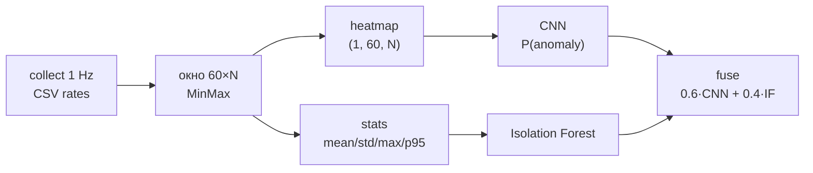
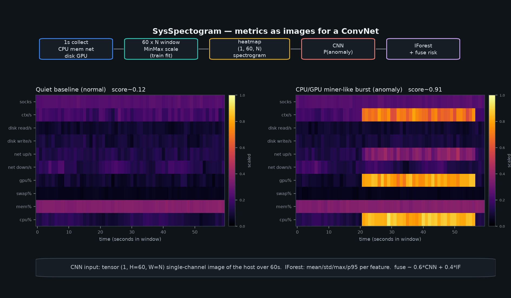

# SysSpectogram

[English](README.md) · [Русский](README_RU.md)

Linux-утилита для **защиты VPS / хоста**: ML по «спектрограммам» метрик (CNN + Isolation Forest), периметр/egress, Telegram SOAR-lite, live web / Mini App и **Rust-агент v3** (процессы / пути / модули + лёгкие метрики).

**Область (v0.8):** защита Linux VPS — всё из v0.7 плюс подписанные manifest'ы артефактов/моделей, детерминированный SPDX SBOM, Dependabot, AUR/Debian-пакеты, безопасная загрузка checkpoint и opt-in enforcement цепочки поставки. Live **VMI** остаётся в **v1.0** ([docs/VMI.md](docs/VMI.md)).

**Live demo:** [lifeqsoll.github.io/SysSpectogram/demo](https://lifeqsoll.github.io/SysSpectogram/demo/)

**Документы:** [Configure](docs/CONFIGURE.md) · [Cold install](docs/COLD_INSTALL.md) · [Supply chain](docs/SUPPLY_CHAIN.md) · [Конфиг](docs/CONFIG_RU.md) · [Рецепты](docs/RECIPES_RU.md) · [Telegram](docs/TELEGRAM_RU.md) · [Live web](docs/WEBAPP_RU.md) · [Agent](docs/AGENT.md) · [Root watch](docs/ROOT_WATCH.md) · [Sessions](docs/SESSIONS.md) · [Feedback](docs/FEEDBACK.md) · [Agent protect](docs/AGENT_PROTECT.md) · [Day-0](docs/DAY0_VPS.md) · [Roadmap](docs/ROADMAP_QUALITY.md) · [Release v0.8](docs/RELEASE_v0.8.0.md) · [Симуляции](simulations/README_RU.md)

### Что нового в v0.7

| Часть | Статус |
| --- | --- |
| `sysspectogram configure` — Day-0 TUI + host probe | да — [CONFIGURE.md](docs/CONFIGURE.md) |
| ProcessLabelRules (As normal / anomaly / + similar) | да — [FEEDBACK.md](docs/FEEDBACK.md) |
| Role FP labels + `/digest` | да |
| Flow netview (`ss`) | да |
| Response audit + kirk badge в web | да |
| IF-only refit на VPS (CNN не трогаем) | да |
| eBPF setuid→0 | да (fallback ProcWatcher) |
| Cold-install чеклист | да — [COLD_INSTALL.md](docs/COLD_INSTALL.md) |

```bash
source .venv/bin/activate
# Day-0: меню в ЭТОМ терминале (не браузер и не отдельное окно)
python -m sysspectogram configure
# или без вопросов:
# python -m sysspectogram configure --accept-recommended --role ssh

cd agent && cargo build --release && cd ..
python -m sysspectogram guard --model artifacts/real_v3 --telegram --dry-run
```

---

## Содержание

1. [Что делает](#что-делает)
2. [Требования](#требования)
3. [Установка](#установка)
4. [Основные понятия](#основные-понятия)
5. [Полный цикл работы](#полный-цикл-работы)
6. [Сценарии](#сценарии)
7. [Справочник CLI](#справочник-cli)
8. [Telegram](#telegram)
9. [Артефакты и выходные файлы](#артефакты-и-выходные-файлы)
10. [Docker](#docker)
11. [systemd](#systemd)
12. [Ограничения](#ограничения-и-безопасность)
13. [Проблемы](#типичные-проблемы)

---

## Что делает

### Метрики → спектрограмма → CNN (ядро DL)

Телеметрия хоста как **вход для computer vision**: каждая секунда — строка rates (CPU, mem, net, disk, GPU, …); окно **60×N** становится одноканальным heatmap («спектрограммой») для маленького **ConvNet**, Isolation Forest видит то же окно как tabular stats. Скор сливается в один host risk.





*Рисунок: quiet baseline vs CPU/GPU miner-like burst так, как это видит CNN. Превью окон: [`build-dataset --png`](#build-dataset) → [normal](docs/assets/window-preview-normal.png) / [anomaly](docs/assets/window-preview-anomaly.png). Демо: [GitHub Pages](https://lifeqsoll.github.io/SysSpectogram/demo/).*

| Этап | Назначение |
| --- | --- |
| `collect` | Пишет поминутные (посекундные) rates метрик в CSV |
| `simulate` / `simulations/` | Локальная нагрузка cpu/mem/disk/net/gpu |
| `build-dataset` | Нарезает CSV на окна 60×N (train/val) |
| `train` | Обучает CNN + Isolation Forest, сохраняет артефакты |
| `monitor` | Живой детект по буферу последних 60 секунд |
| `watch-perimeter` | Auth brute / inbound scan / egress denylist / DNS |
| `recon` | OSINT + optional nmap по IP |
| `guard` | perimeter + host ML + Telegram slash/inline |
| `lab-nmap` | nmap только allowlisted lab targets |
| `analyze` | Офлайн-прогон CSV обученной моделью |
| `audit` | processes / ports / rootkit / report |

Формула скора по умолчанию:

`score = 0.6 * P_cnn(anomaly) + 0.4 * IsolationForest_score`

Порог на валидации подбирается с упором на высокий Recall (см. `configs/default.yaml`).

---

## Требования

- Linux (любой распространённый дистрибутив)
- Python 3.10+
- Опционально: Rust toolchain для сборки `sysspectogram-agent`
- Опционально eBPF: `clang`/`llvm` + BTF ядра; attach от **root** ([EBPF_SETUP.md](docs/EBPF_SETUP.md))
- Опционально: `notify-send` для desktop-уведомлений
- Опционально: Docker для воспроизводимого обучения
- `stress-ng` не обязателен: встроенных симуляторов достаточно

---

## Установка

```bash
git clone <repo-url> SysSpectogram
cd SysSpectogram
python -m venv .venv
source .venv/bin/activate

# CPU-сборка PyTorch (рекомендуется без NVIDIA CUDA):
pip install torch --index-url https://download.pytorch.org/whl/cpu
pip install -e ".[dev]"

python -m sysspectogram --help

# Day-0: интерфейс в терминале (клавиатура, не браузер)
python -m sysspectogram configure
# без меню — принять рекомендации probe:
# python -m sysspectogram configure --accept-recommended --role ssh
```

После установки доступны команда `sysspectogram` и `python -m sysspectogram`.

---

## Основные понятия

### Метрики (rates, не сырые счётчики)

Каждая строка CSV — одна секунда. Сеть, диск, context switches — это **дельты в секунду**. Абсолютные счётчики в обучение не идут, чтобы uptime не доминировал над аномалией.

В колонках: CPU (общий и до `max_cores` ядер), память/swap, page faults, сетевые байты/пакеты в секунду, число сокетов ESTABLISHED/LISTEN (опрос раз в N секунд), дисковый I/O.

### Окна → «картинка» для CNN

- Окно по умолчанию: **60 секунд** × N признаков → тензор **`(1, 60, N)`** после `window_to_tensor`
- Шаг при сборке датасета: **5 секунд** (перекрывающиеся окна)
- `MinMax`-скейлер учится **только на train** и сохраняется для inference
- Опциональные PNG: `build-dataset --png` (для глаз; модель учится на `.npy`)

CNN не смотрит сырые процессы. Она смотрит, **как выглядит весь хост за минуту** — та же идея, что спектрограммы / heatmaps в CV и audio DL.

### Ансамбль

- **CNN** — маленькая сеть по одноканальному тензору 60×N
- **Isolation Forest** — статистики по тому же окну (mean/std/max/p95)
- Артефакты в одной папке: `cnn.pt`, `iforest.joblib`, `scaler.joblib`, `meta.json`

### Разметка

Нужны отдельные CSV **normal** и **anomaly**. Инструмент сам разметку не придумывает. Норму собирайте в обычной работе; аномалию — через `simulate` / `simulations/` или реальные инциденты.

---

## Полный цикл работы

### 1. Нормальный профиль

```bash
python -m sysspectogram collect --out data/normal.csv --duration 3600
```

Для устойчивого профиля лучше 1–2 часа обычной нагрузки.

### 2. Аномальный профиль

Терминал A:

```bash
python -m sysspectogram collect --out data/anomaly.csv --duration 1200
```

Терминал B:

```bash
python -m sysspectogram simulate cpu --duration 900 --workers 2
# или:
python simulations/cpu_miner.py --duration 900
```

Память, диск и localhost-сеть: [simulations/README.md](simulations/README.md).

### 3. Датасет

```bash
python -m sysspectogram build-dataset \
  --normal data/normal.csv \
  --anomaly data/anomaly.csv \
  --out dataset/ \
  --window 60 \
  --stride 5
```

Флаг `--png` пишет inferno heatmap рядом с каждым `.npy` (только превью; обучение по тензорам). Пример:

```bash
python -m sysspectogram build-dataset \
  --normal data/normal.csv \
  --anomaly data/anomaly.csv \
  --out dataset/real \
  --window 60 --stride 5 \
  --png
# → dataset/real/train/anomaly/*.png  (+ .npy)
```

### 4. Обучение

```bash
python -m sysspectogram train --dataset dataset/ --out artifacts/ --epochs 15
```

Смотрите Precision / Recall / F1 и `artifacts/meta.json`.

### 5. Realtime

```bash
python -m sysspectogram monitor --model artifacts/ --interval 5 --cooldown 60
```

При аномалии: вывод в терминал, опционально `notify-send`, top-процессы, опционально JSONL.

### 6. Офлайн на сервере

```bash
python -m sysspectogram analyze \
  --csv data/night.csv \
  --model artifacts/ \
  --out reports/night.json
```

### 7. Аудит без модели

```bash
python -m sysspectogram audit processes
python -m sysspectogram audit ports
python -m sysspectogram audit report --out reports/audit.json
```

---

## Сценарии

### Домашняя/рабочая станция и имитация майнера по CPU

1. Час `collect` нормы.  
2. `collect` аномалии параллельно с `simulate cpu`.  
3. `build-dataset` → `train` → `monitor`.  

**Зачем:** ловить устойчивые аномальные паттерны CPU и сразу видеть PID в топе.

### VPS: ночной лог без интерактива

1. Таймер: `collect --duration 86400`.  
2. Утром: `analyze` по CSV с готовыми `artifacts/`.  

**Зачем:** ретроспектива поведения без постоянного GUI-сеанса.

### Быстрый разбор «что сейчас на хосте»

```bash
python -m sysspectogram audit report --out reports/triage.json
```

**Зачем:** инвентаризация нагрузки и портов. Дополняет `monitor`, не заменяет его.

### Смена роли сервера

После смены сервисов соберите новый normal CSV и переобучите модель. Старые артефакты описывают старую «норму».

---

## Справочник CLI

Общий вид:

```text
python -m sysspectogram [--config PATH] [--version] <command> ...
```

| Глобальный флаг | Обязателен | По умолчанию | Описание |
| --- | --- | --- | --- |
| `--config` | нет | `configs/default.yaml` | YAML с настройками collector/window/train/monitor |
| `--version` | нет | — | Версия пакета |
| `-h` / `--help` | нет | — | Справка по программе или подкоманде |

---

### `configure` (главная фича Day-0)

Интерактивная настройка **в терминале** (таблицы Rich + вопросы). Это не веб-страница и не отдельное GUI-окно — открой терминал в репо:

```bash
source .venv/bin/activate
python -m sysspectogram configure
```

| Флаг | Описание |
| --- | --- |
| `--accept-recommended` | Применить рекомендации host_probe без меню |
| `--role ssh\|nginx\|…` | Роль для FP-меток процессов |
| `--prefix PATH` | Корень установки (по умолчанию `.`) |
| `--no-seed-fp` | Не сидить process labels |

См. [docs/CONFIGURE.md](docs/CONFIGURE.md), [docs/COLD_INSTALL.md](docs/COLD_INSTALL.md).

Также: `labels list|seed|del`, `feedback retrain-if`, `feedback status`.

---

### `collect`

Пишет метрики в CSV (дописывает; заголовок — если файл новый/пустой).

```bash
python -m sysspectogram collect --out data/normal.csv --duration 3600
```

| Флаг | Обязателен | По умолчанию | Описание |
| --- | --- | --- | --- |
| `--out` | **да** | — | Путь к CSV |
| `--duration` | нет | бесконечно (до Ctrl+C) | Останов через N секунд |

Из конфига: `collector.interval_sec`, `max_cores`, `socket_sample_every`.

---

### `build-dataset`

Нарезка CSV в `train/` и `val/` как `.npy`.

```bash
python -m sysspectogram build-dataset \
  --normal data/normal.csv \
  --anomaly data/anomaly.csv \
  --out dataset/ \
  --window 60 \
  --stride 5 \
  --png
```

| Флаг | Обязателен | По умолчанию | Описание |
| --- | --- | --- | --- |
| `--normal` | **да** | — | Один или несколько CSV нормы |
| `--anomaly` | **да** | — | Один или несколько CSV аномалии |
| `--out` | **да** | — | Корень датасета |
| `--window` | нет | `window.size` (60) | Число строк в окне |
| `--stride` | нет | `window.stride` (5) | Шаг между окнами |
| `--png` | нет | выкл. | Inferno heatmap PNG рядом с каждым `.npy` (превью; train по тензорам) |

Создаёт `meta.json` и `scaler.joblib` в корне датасета.

---

### `train`

Обучение ансамбля.

```bash
python -m sysspectogram train --dataset dataset/ --out artifacts/ --epochs 15
```

| Флаг | Обязателен | По умолчанию | Описание |
| --- | --- | --- | --- |
| `--dataset` | **да** | — | Корень датасета |
| `--out` | **да** | — | Каталог артефактов |
| `--epochs` | нет | `train.epochs` (15) | Эпохи CNN |

Остальные гиперпараметры — из YAML (`batch_size`, `lr`, веса fusion, `recall_target`, `seed`).

---

### `monitor`

Realtime: раз в 1 с сэмпл в deque на `window_size`, inference каждые `--interval` секунд.

```bash
python -m sysspectogram monitor \
  --model artifacts/ \
  --interval 5 \
  --cooldown 60 \
  --jsonl-out reports/alerts.jsonl
```

| Флаг | Обязателен | По умолчанию | Описание |
| --- | --- | --- | --- |
| `--model` | **да** | — | Каталог артефактов |
| `--interval` | нет | `monitor.interval_sec` (5) | Пауза между inference |
| `--cooldown` | нет | `monitor.cooldown_sec` (60) | Мин. пауза между алертами |
| `--jsonl-out` | нет | нет | JSONL с событиями аномалий |

Останов: Ctrl+C.

---

### `analyze`

Скользящие окна по CSV.

```bash
python -m sysspectogram analyze \
  --csv data/anomaly.csv \
  --model artifacts/ \
  --out reports/analyze.json
```

| Флаг | Обязателен | По умолчанию | Описание |
| --- | --- | --- | --- |
| `--csv` | **да** | — | Входной CSV |
| `--model` | **да** | — | Артефакты |
| `--out` | нет | нет | JSON-отчёт (сводка печатается всегда) |

Шаг окон — `window.stride` из конфига.

---

### `audit`

Снимок хоста. Позиционный аргумент выбирает режим.

```bash
python -m sysspectogram audit processes
python -m sysspectogram audit ports
python -m sysspectogram audit report --out reports/audit.json
```

| Аргумент / флаг | Обязателен | По умолчанию | Описание |
| --- | --- | --- | --- |
| `what` | **да** | — | `processes` \| `ports` \| `report` |
| `--out` | нет | stdout для `report` | Путь JSON при `report` |

---

### `simulate`

Локальные генераторы нагрузки. Сеть — только `127.0.0.1`.

```bash
python -m sysspectogram simulate cpu --duration 900 --workers 2
python -m sysspectogram simulate mem --duration 300 --mb 512
python -m sysspectogram simulate disk --duration 300 --block-mb 32
python -m sysspectogram simulate net --duration 900 --rate 80
python -m sysspectogram simulate gpu --duration 60 --gpu-size 4096
```

| Аргумент / флаг | Обязателен | По умолчанию | Описание |
| --- | --- | --- | --- |
| `kind` | **да** | — | `cpu` \| `mem` \| `disk` \| `net` \| `gpu` |
| `--duration` | нет | 60 | Длительность, сек |
| `--workers` | нет | ~половина CPU | Число процессов для `cpu` |
| `--mb` | нет | 512 | МБ памяти для `mem` |
| `--block-mb` | нет | 32 | Размер блока для `disk` |
| `--rate` | нет | 80 | Коннектов/сек на localhost для `net` |
| `--gpu-size` | нет | 2048 | Размер матрицы для `gpu` (нужен CUDA torch) |

Скрипты в `simulations/` делают то же самое вне CLI.

### Лучшие рецепты

Полный набор: **[docs/RECIPES_RU.md](docs/RECIPES_RU.md)**.

```bash
python -m sysspectogram collect --out data/normal.csv --duration 1800
python -m sysspectogram simulate cpu --duration 900 --workers 8 &
python -m sysspectogram collect --out data/anomaly_cpu.csv --duration 900
python -m sysspectogram build-dataset \
  --normal data/normal.csv --anomaly data/anomaly_cpu.csv \
  --out dataset/real --window 60 --stride 5 \
  --max-normal-cpu-mean 25 --min-anomaly-cpu-mean 45
python -m sysspectogram train --dataset dataset/real --out artifacts/real_v3 --epochs 25
python -m sysspectogram guard --model artifacts/real_v3 --telegram --dry-run
```

---

### `watch-perimeter`

Auth journal + inbound/egress + DNS watch. Auto recon на alert (cooldown per IP).

```bash
python -m sysspectogram watch-perimeter --duration 60 --jsonl-out reports/perimeter.jsonl
```

### `recon`

```bash
python -m sysspectogram recon 203.0.113.50
python -m sysspectogram recon 203.0.113.50 --no-nmap
```

### `guard`

Периметр + host ML + Telegram (нужны `TELEGRAM_BOT_TOKEN` и `TELEGRAM_CHAT_ID` в `.env`).

```bash
python -m sysspectogram guard --model artifacts/real_v3 --telegram --dry-run
```

---

## Telegram

Полный справочник: **[docs/TELEGRAM_RU.md](docs/TELEGRAM_RU.md)** · рецепты: **[docs/RECIPES_RU.md](docs/RECIPES_RU.md)**.

С телефона (пока крутится `guard --telegram`): `/help` `/menu` `/panel` `/score` `/audit` `/processes` `/ports` `/rootkit` `/simulate` `/collect` `/analyze` `/recon` `/ban` `/recipes` …

Длинные `train` / `build-dataset` / `monitor` — только в терминале. На алерте — dual heatmap + confirm Ban/Kill.

### `lab-nmap`

```bash
python -m sysspectogram lab-nmap 127.0.0.1 --lab
```

### `audit`

```bash
python -m sysspectogram audit processes
python -m sysspectogram audit ports
python -m sysspectogram audit rootkit
python -m sysspectogram audit report --out reports/audit.json
```

---

## Артефакты и выходные файлы

| Путь | Содержимое |
| --- | --- |
| `data/*.csv` | Временной ряд метрик |
| `dataset/train|val/.../*.npy` | Окна |
| `dataset/scaler.joblib` | Скейлер |
| `dataset/meta.json` | Колонки, окно, counts |
| `artifacts/*` | Модель, порог, метрики |
| `reports/*.json` | Отчёты analyze/audit |
| `reports/*.jsonl` | Поток алертов monitor |

---

## Docker

**Внимание:** Docker удобен для **train** / **analyze**. Не запускайте `monitor` / `guard` в обычном контейнере ожидая IDS «как на хосте» — видны cgroup-метрики и сетевой namespace контейнера. `--pid=host --net=host` — осознанный компромисс. Для live-детекции предпочтительна native systemd-установка.

```bash
docker build -t sysspectogram .
docker run --rm \
  -v "$PWD/dataset:/dataset" \
  -v "$PWD/artifacts:/artifacts" \
  sysspectogram train --dataset /dataset --out /artifacts
```

В образе по умолчанию CPU PyTorch.

---

## systemd

- Monitor: [scripts/systemd/sysspectogram-monitor.service](scripts/systemd/sysspectogram-monitor.service)
- Guard: [scripts/systemd/sysspectogram-guard.service](scripts/systemd/sysspectogram-guard.service)
- Agent: [scripts/systemd/sysspectogram-agent.service](scripts/systemd/sysspectogram-agent.service) (для eBPF — от root; [EBPF_SETUP.md](docs/EBPF_SETUP.md))

Секреты — в `/opt/sysspectogram/.env` (или `/etc/sysspectogram.env`); unit'ы читают `EnvironmentFile=-…`. Укажите `--model`, затем `systemctl enable --now …`. Хелпер: `scripts/install.sh`. В unit'ах есть hardening (`ProtectSystem`, `PrivateTmp`, …); для живого nft без `--dry-run` может понадобиться ослабить ограничения.

---

## Ограничения и безопасность

- Качество модели = качество **ваших** размеченных CSV. Модель с ноутбука не равна профилю БД на VPS.  
- Не ловит kernel-rootkit и не знает malware по имени. Userspace `/proc` можно обмануть LKM; eBPF `execve`/`openat` сужает слепую зону, но не даёт полной гарантии.  
- Симуляции только на этой машине / localhost.  
- Эвристики `audit` — подсказки, не доказательство.  
- Без notification daemon уведомления только в терминал/JSONL.  
- **Telegram / Mini App:** `.env` — чувствительный. Console unlock (`/unlock`) блокирует управление при утечке токена, но **не** защищает, если атакующий уже на консоли хоста. Держите `require_console_unlock: true`, короткий TTL, не кладите код unlock в чат специально.  
- Сокет агента: `$XDG_RUNTIME_DIR`, mode `0600`; web-порт не слушайте на `0.0.0.0` без прокси + auth.  

---

## Типичные проблемы

| Симптом | Что проверить |
| --- | --- |
| Нет окон в `build-dataset` | CSV короче `--window` |
| Плохой F1 | Мало данных, пересекающиеся классы, дисбаланс |
| `monitor` молчит | Порог; проверьте `analyze` на заведомой аномалии |
| Спам алертов | Увеличьте `--cooldown` |
| Ошибки torch | Переустановите CPU wheel с официального CPU index |
| Пустые сокеты | Права / нет `/proc/net/tcp` в окружении |

```bash
pytest -q
```

---

## Лицензия

MIT. См. [LICENSE](LICENSE).

## О следующих версиях

**v0.8:** подписи артефактов/моделей, SPDX SBOM, Dependabot, AUR/Debian packaging, safe checkpoint loading и opt-in проверка подписей на VPS. См. [SUPPLY_CHAIN.md](docs/SUPPLY_CHAIN.md), [ROADMAP_QUALITY.md](docs/ROADMAP_QUALITY.md), [RELEASE_v0.8.0.md](docs/RELEASE_v0.8.0.md). Дальше: условный VMI в v1.0 для собственного KVM.
