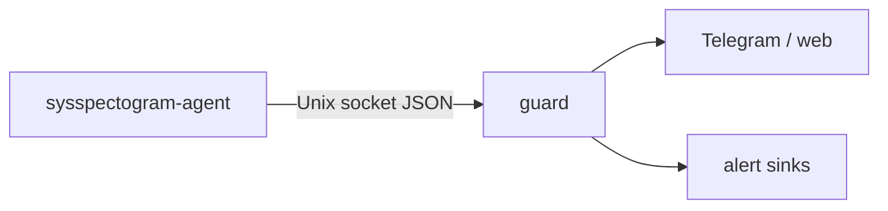

# SysSpectogram agent (integrity + metrics sensor)

Rust side-car: process / integrity signals + lightweight `/proc` metrics for the live web bus.
Complements host-metric CNN (Python for full feature vectors).

Optional **eBPF** mode: `execve` / `openat` / module via clang BPF + Aya. See [EBPF_SETUP.md](EBPF_SETUP.md).

## What it covers

| Layer | Agent |
| --- | --- |
| Live web charts | Rust metrics (`kind=metrics`) |
| Quiet file touch | `/proc` fd sample + inotify + optional eBPF `openat` |
| New processes | new PID ≈ exec + optional eBPF `execve` |
| Kernel modules | `/proc/modules` delta + optional eBPF module probes |
| Unexpected root | same `/proc` walk → `agent_unexpected_root` ([ROOT_WATCH.md](ROOT_WATCH.md)) |
| FIM | sha256 poll (`--fim`); baseline at `state/fim-baseline.json` (default on `lite`) |
| Auth | HMAC + PEERCRED + PID allowlist + exe seal ([AGENT_PROTECT.md](AGENT_PROTECT.md)) |

**Not** a full rootkit killer. Userspace `/proc` can still be lied to by advanced LKM; eBPF helps but is not a silver bullet.

## Operator quickstart

How the agent talks to Python `guard`:



Typical paths:

1. **Preferred:** `guard` with `agent.auto_start: true` (spawns agent + optional `--phoenix`).
2. **systemd:** [packaging/distro/sysspectogram-agent.service](../packaging/sysspectogram-agent.service).
3. **Standalone:**

```bash
sudo install -m 0755 -o root -g root \
  agent/target/release/sysspectogram-agent /usr/local/sbin/sysspectogram-agent
sudo /usr/local/sbin/sysspectogram-agent \
  --mode userspace \
  --phoenix \
  --fim \
  --fim-baseline state/fim-baseline.json \
  --socket /run/sysspectogram/agent.sock \
  --hmac-secret /var/lib/sysspectogram/state/agent_hmac.secret \
  --pidfile /run/sysspectogram/agent.pid
```

Key flags (see `--help` for full list): `--mode`, `--phoenix`, `--fim`, `--fim-baseline`, `--socket`, `--hmac-secret`, `--pidfile`, `--jsonl`.

**Privileges:** eBPF attach usually needs root (or carefully reviewed caps). Userspace mode needs less. Install the binary root-owned under `/usr/local/sbin` — [AGENT_PROTECT.md](AGENT_PROTECT.md).

Optional kernel PID registry: [packaging/kmod/sysspectogram_wd/README.md](../packaging/kmod/sysspectogram_wd/README.md) (`watchdog.kernel_protect`, default off).

## eBPF

Build: `clang`, `llvm`, kernel BTF (`/sys/kernel/btf/vmlinux`).  
Attach: **real root** (on Arch, `/sys/kernel/tracing` is `0700` — `setcap` alone → `tracefs not found`).

```bash
cd agent && cargo build --release
sudo -E ./target/release/sysspectogram-agent \
  --mode ebpf \
  --socket "$XDG_RUNTIME_DIR/sysspectogram-agent.sock" \
  --hmac-secret state/agent_hmac.secret
```

Without root/clang, `--mode ebpf` falls back to userspace. Details: [EBPF_SETUP.md](EBPF_SETUP.md).

## Build

```bash
cd agent
cargo build --release
# binary: agent/target/release/sysspectogram-agent
# skip BPF: SYSSPECTOGRAM_SKIP_EBPF=1 cargo build --release --no-default-features
```

## Run

```bash
# configs/default.yaml → agent.enabled: true, agent.root_watch: true
.venv/bin/python -m sysspectogram guard --model artifacts/real_v3 --telegram --dry-run
# auto_start spawns the agent; or:
./agent/target/release/sysspectogram-agent \
  --socket /tmp/sysspectogram-agent.sock \
  --metrics-ms 1000 \
  --hmac-secret state/agent_hmac.secret \
  --root-watch --root-learn-sec 300
```

Telegram AGENT / ROOT alerts include **Kill** / feedback buttons (after console `/unlock`).

## Alert JSON (`schema: sysspectogram.agent.v1`)

Rules include: `agent_open_sensitive`, `agent_exec_burst`, `agent_connect_burst`,
`agent_module_load`, `agent_fim_*`, `agent_ebpf_*`, `agent_unexpected_root`,
`agent_kirk_*` (module hide, symbol drift, clean_shutdown, agent/guard down, …).

Critical kirk + `agent_unexpected_root` require HMAC when `require_hmac: true`.

## Metrics JSON (`schema: sysspectogram.metrics.v1`)

```json
{"schema":"sysspectogram.metrics.v1","kind":"metrics","cpu_percent":12.0,"mem_percent":40.0}
```

## Config

```yaml
agent:
  enabled: true
  auto_start: true
  mode: userspace   # or ebpf (attach needs root)
  metrics: true
  socket: null      # null → $XDG_RUNTIME_DIR/sysspectogram-agent.sock (0600)
  require_hmac: true
  require_same_uid: true
  hmac_secret: state/agent_hmac.secret
  root_watch: true
  root_learn_sec: 300
  cooldown_sec: 60
```

## systemd

Unit: [packaging/sysspectogram-agent.service](../packaging/sysspectogram-agent.service).
Install helper: [scripts/install.sh](../scripts/install.sh). Prefer
`/usr/local/sbin/sysspectogram-agent` root-owned — [AGENT_PROTECT.md](AGENT_PROTECT.md).

## Docs

[ROOT_WATCH.md](ROOT_WATCH.md) · [AGENT_PROTECT.md](AGENT_PROTECT.md) · [KIRK.md](KIRK.md) · [ROADMAP_QUALITY.md](ROADMAP_QUALITY.md)
