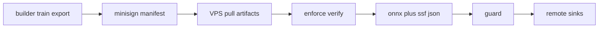

# Supply chain: builder → VPS

How signed artifacts move from a training machine to a running guard without trusting pickle or unsigned weights.

## Responsibilities

| Role | Does |
| --- | --- |
| Builder PC | `train`, `export-onnx`, `artifacts migrate`, sign manifest |
| VPS | `runtime: onnx` or `notorch`, `supply_chain.enforce` when key installed, never full CNN train |
| Release CI | Sign agent binary, wheels, SBOM, packs |

## What is verified

- `artifacts.manifest.json` SHA-256 list
- Optional `.minisig` (minisign)
- Runtime loads: `cnn.onnx` / `cnn.pt` (`weights_only`), `scaler.json`, `iforest.ssf.npz`
- Legacy `.joblib` is **not** loaded at runtime — migrate first

## Operator checklist

1. Install public key under `/etc/sysspectogram/` (or path in config).
2. `python -m sysspectogram artifacts migrate --model DIR --delete-legacy` for old packs.
3. `python -m sysspectogram supply-chain verify DIR --enforce --public-key …`
4. Set `supply_chain.enforce: true` in YAML.
5. Prefer remote `alerts.sinks` (HTTPS/syslog TLS) so local wipe is incomplete.

Commands and key formats: [SUPPLY_CHAIN.md](SUPPLY_CHAIN.md). Release notes: [RELEASE_v0.9.0.md](RELEASE_v0.9.0.md).
