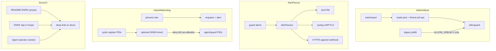

# SysSpectogram v0.9 Hardening + Docs UX Plan

> Реализация после approve. Сейчас только план.

**Goal:** усилить single-VPS defense без претензий на EDR/kernel-rootproof **и** разгрузить перегруженный README/доки (группы ссылок, честный ONNX-путь, как жить с Rust-агентом).

**Architecture:** семь треков (A–F код/безопасность, G документация). Userspace-first; kernel module — opt-in DKMS, default off.



**Tech stack:** Python 3 (numpy/sklearn params dump), Rust agent (FIM/phoenix), C kernel module + DKMS (optional), existing nft/kirk, Markdown docs.

**Out of scope:** полный SIEM SDK, обязательный второй хост, агрессивный nmap, VMI (остаётся v1.0), unsigned module как default на облачных VPS, переписывание всего README в микро-книгу (только структура + дыры).

---

## Track A — Safe model artifacts (priority 1)

**Проблема:** [`sysspectogram/ml/forest.py`](sysspectogram/ml/forest.py) и [`sysspectogram/preprocess/scaler.py`](sysspectogram/preprocess/scaler.py) делают `joblib.load` → pickle RCE-класс.

**Решение (зафиксировано):**
- `scaler.json` — сериализация `RobustScaler` params (`center_`, `scale_`, `n_features_in_`) + `n_features`.
- `iforest.ssf.npz` — кастомный формат деревьев IsolationForest (estimators arrays + meta JSON sidecar `iforest.ssf.meta.json`); без pickle.
- Train/export/pack пишут **только** новые форматы.
- Load path: сначала `.json` / `.ssf.npz`; legacy `.joblib` только если `SYSSPECTOGRAM_ALLOW_JOBLIB=1` (+ warning); при `supply_chain.enforce` joblib **запрещён**.
- Обновить [`sysspectogram/ml/infer.py`](sysspectogram/ml/infer.py), [`infer_onnx.py`](sysspectogram/ml/infer_onnx.py), [`train.py`](sysspectogram/ml/train.py), [`feedback_iforest.py`](sysspectogram/feedback_iforest.py), [`export_onnx.py`](sysspectogram/ml/export_onnx.py), manifest allowlist в supply_chain, docs [`SUPPLY_CHAIN.md`](docs/SUPPLY_CHAIN.md).
- CLI helper: `python -m sysspectogram artifacts migrate --model DIR` (joblib → safe).

**Tests:** round-trip scaler/forest score parity vs legacy joblib fixture; enforce refuses joblib; migrate smoke.

---

## Track B — Remote alert sinks (priority 2)

**Проблема:** алерты только в локальный jsonl / Telegram pager.

**Решение (зафиксировано):** тонкий fan-out, не SIEM.
- Новый модуль [`sysspectogram/alerts/fanout.py`](sysspectogram/alerts/fanout.py): `AlertFanout.emit(event: dict)`.
- Sinks:
  - `file` — существующий `append_jsonl`
  - `syslog` — RFC5424 over UDP **или** TLS (`ssl.wrap_socket`); конфиг host/port/facility/tls_ca
  - `https` — POST JSON, optional Bearer; timeout short; failures logged, non-blocking
- Конфиг в [`configs/default.yaml`](configs/default.yaml):

```yaml
alerts:
  sinks:
    - type: file
      path: reports/alerts.jsonl
    # - type: syslog
    #   host: siem.example
    #   port: 6514
    #   transport: tls
    # - type: https
    #   url: https://collector.example/ingest
    #   token_env: SS_ALERT_TOKEN
```

- Вшивка в [`guard.py`](sysspectogram/guard.py) в местах `append_jsonl` для host/perimeter/agent critical alerts (единая точка рядом с текущими jsonl writes ~755, ~1144 и agent alert path).
- Fail-open: sink error не роняет guard.

**Tests:** mock UDP/TLS/HTTPS; fanout вызывается; file sink parity.

---

## Track C — FIM defaults + baseline seal (priority 3)

**Уже есть:** [`agent/src/fim.rs`](agent/src/fim.rs), флаг `--fim` из [`guard.py`](sysspectogram/guard.py) ~1365.

**Добить:**
- Persist baseline → `state/fim-baseline.json` (+ sha256 seal sidecar), reload across restarts (сейчас только in-memory).
- `lite` preset: FIM **enabled**, `interval_sec: 300`, default critical paths (сейчас lite `enabled: False` в [`load_profile.py`](sysspectogram/load_profile.py)).
- `full`: оставить enabled, interval 30–60.
- `configs/default.yaml` + `configure` Day-0: показать FIM on/off.
- Docs: [`AGENT.md`](docs/AGENT.md), [`DAY0_VPS.md`](docs/DAY0_VPS.md) — FIM не optional footnote.

**Tests:** baseline file round-trip; drift emits `agent_fim_*`.

---

## Track D — Honest Limitations messaging (priority 4)

- README EN/RU: короткий блок **Limitations** — same-host root может stop/wipe; remote sinks + supply_chain снижают blast radius; не «unkillable».
- Обновить [`SECURITY.md`](SECURITY.md), [`AGENT_PROTECT.md`](docs/AGENT_PROTECT.md) ссылкой на hybrid watchdog.
- [`ROADMAP_QUALITY.md`](docs/ROADMAP_QUALITY.md): фаза **v0.9 hardening** (этот план); VMI остаётся v1.0.

---

## Track E — Narrow auto-isolate expansion (priority 5)

**Сейчас:** allowlist только kirk CRITICAL rules в [`guard.py`](sysspectogram/guard.py) ~1025–1031.

**Добавить (default off):**
```yaml
kirk:
  auto_isolate: false
  auto_isolate_host_risk: false   # NEW
  host_risk_threshold: 0.99
```
- Если `auto_isolate` **и** `auto_isolate_host_risk`, и fused host risk ≥ threshold, и `allow_ssh_cidrs` задан → `nft.kirk_isolate` (тот же путь).
- Без HMAC agent path для host-risk (это ML path) — документировать риск FP; default false.
- Не расширять nmap/recon.

**Tests:** threshold gate; refuses without CIDRs; dry-run.

---

## Track F — Hybrid kernel watchdog C (priority 6)

**Userspace (default on path, усиливаем существующее):**
- Phoenix уже в [`agent/src/phoenix.rs`](agent/src/phoenix.rs).
- Усиления:
  - при unexpected death: emit signed alert **до/сразу после** respawn (через UDS/jsonl), и если настроен AlertFanout — remote sink из guard Dead-man path;
  - опционально watch **guard** pid (уже есть куски `guard_pidfile` в main) — документировать и включить в packaging unit;
  - systemd units: `Restart=always` + `WatchdogSec=` где уместно в [`packaging/distro/*.service`](packaging/distro/).

**Kernel (opt-in, default off):**
- Новый каталог [`packaging/kmod/sysspectogram_wd/`](packaging/kmod/sysspectogram_wd/):
  - out-of-tree module + DKMS `dkms.conf`, `Makefile`
  - sysfs: `/sys/module/sysspectogram_wd/parameters/` или `/sys/fs/sysspectogram_wd/protected_pids` — userspace регистрирует PIDs агента/watchdog/guard
  - LSM/`security_task_kill`-style hook **или** эквивалент через `task_kill` trace+deny где возможно; цель: deny `kill`/`ptrace` на protected PIDs от non-allowlisted callers
  - allowlist UID 0 admin override via sysfs `admin_token` / `unprotect` для updates
- Конфиг:
```yaml
watchdog:
  phoenix: true
  kernel_protect: false   # requires loaded signed/DKMS module
```
- Agent: если `kernel_protect` и module present → register PIDs; иначе log once и continue.
- Docs: cloud VPS часто **не** позволяют unsigned modules / no Secure Boot signing — feature для self-hosted/custom kernel; residual: root может `rmmod` если модуль не locked; не претендовать на unkillable.

**Tests:** userspace phoenix unit tests / lab script; kmod — compile smoke в CI optional (`if [ -d /lib/modules/$(uname -r) ]`); skip в обычном pytest.

---

## Track G — README / docs UX (priority 0 for docs, ship with release)

**Проблема:** одна простыня «Related docs» в [`README.md`](README.md) / [`README_RU.md`](README_RU.md); маркетинг про ONNX, а в теле README доминирует Torch/`.pt`; Rust-агент — только `cargo build`, без «как говорит с Python / какие флаги / нужен ли root».

### G1 — Сгруппировать ссылки на доки (не одна строка)

Заменить плоский список на логические группы (EN + зеркало RU). Ссылки остаются на существующие `docs/*` — **не** плодить дубликаты файлов без нужды; README только каталогизирует.

**Группы (зафиксировано):**

1. **Deploy & configure** — Configure, Cold install, Configuration / CONFIG_RU, Day-0, Profiles  
2. **Defense components** — Agent, Agent protect, Root watch, eBPF, Kirk, VMI  
3. **Control surfaces** — Telegram, Live web / Mini App, Sessions, Feedback  
4. **Supply chain & packaging** — Supply chain, Release v0.8/v0.9, packaging notes  
5. **Data / ML ops** — Recipes, Train bridge, Role lab, Simulations  
6. **Roadmap** — ROADMAP_QUALITY  

Формат: короткий подзаголовок + bullet-ссылки (1 строка описания на группу максимум). What's new / Scope остаются сверху.

### G2 — Убрать противоречие «ONNX заявлен — в README везде Torch»

Код уже умеет `runtime: notorch | onnx | torch_ml` и `export-onnx` ([`docs/CONFIG.md`](docs/CONFIG.md), [`docs/TRAIN_BRIDGE.md`](docs/TRAIN_BRIDGE.md)). В README не хватает **явного VPS-пути**.

Добавить в README EN/RU (короткий блок рядом с Install / End-to-end, не роман):

1. На builder: `train` → `export-onnx` → в артефактах появляется `cnn.onnx`.  
2. На VPS: `runtime: onnx` (или `notorch` без CNN) в конфиге / `SYSSPECTOGRAM_RUNTIME`.  
3. `guard` / `monitor` с `--model` на каталог, где есть `cnn.onnx` (+ scaler/IF в safe-форматах после Track A).  
4. Ссылка на Train bridge: учить на PC, на VPS не гонять Torch.  
5. В таблицах артефактов: `cnn.onnx` как **рекомендуемый** runtime-артефакт на VPS; `cnn.pt` — builder / optional torch_ml.

Не менять поведение runtime в этом треке — только документация и примеры команд, согласованные с уже существующим CLI.

### G3 — Операторский фрагмент про Rust-агент

Расширить [`docs/AGENT.md`](docs/AGENT.md) секцией **Operator quickstart** (и короткий указатель из README в группу Defense):

- Как говорит с Python: Unix domain socket (путь из конфига / `--socket`), JSONL опционально; HMAC + PEERCRED (ссылка на AGENT_PROTECT).  
- Типичный запуск: через `guard` auto_start **или** systemd unit из packaging; standalone `sysspectogram-agent` с основными флагами (`--mode`, `--phoenix`, `--fim`, `--socket`, `--hmac-secret`, `--pidfile`). Полный `--help` не копировать — 6–10 ключевых args + «см. `--help`».  
- Права: для eBPF / части сигналов — обычно root или capabilities; userspace mode — меньше привилегий; установка бинаря в `/usr/local/sbin` root-owned.  
- Одна схема (mermaid или ascii): `agent → UDS → guard → telegram/web/sinks`.

### G4 — Лёгкая разгрузка тела README (фрагменты)

Не выносить весь CLI reference в отдельные файлы в v0.9 (слишком большой diff). Вместо этого:

- В начале длинных секций CLI / workflow — 3–5 «quick links» на глубокие доки (CONFIGURE, DAY0, AGENT, SUPPLY_CHAIN, TRAIN_BRIDGE).  
- Дублирующие простыни, которые уже полностью покрыты `docs/*`, сократить до 5–15 строк + «подробности в …». Кандидаты на ужатие: повторные Telegram/Web абзацы, если зеркалят WEBAPP/TELEGRAM.  
- EN и RU держать **структурно симметричными** (те же группы, те же новые блоки).

### G5 — Проверка согласованности

Чеклист перед релизом v0.9:

- [ ] README не обещает ONNX без команд export + runtime  
- [ ] Related docs не одной простынёй  
- [ ] Agent: socket / flags / privileges описаны  
- [ ] Limitations (Track D) на месте  
- [ ] Ссылки не битые (оба языка)

**Tests:** не кодовые — ручной/скрипт проверки ссылок `rg`/`markdown` link check по README*.md при желании простой script в `scripts/check-readme-links.py` (optional, small).

---

## Docs / release

- `docs/RELEASE_v0.9.0.md` — hardening tracks **и** docs UX.  
- Обновить SUPPLY_CHAIN, AGENT_PROTECT, CONFIG, CONFIGURE, ROADMAP, AGENT.  
- README What's new → v0.9 bullets (код + docs).

---

## Порядок реализации

1. Track A (safe artifacts) + tests  
2. Track B (fanout sinks) + tests  
3. Track C (FIM baseline/defaults)  
4. Track D (Limitations) — можно параллельно с G  
5. Track G (README groups + ONNX path + agent ops + лёгкое ужатие)  
6. Track E (host-risk isolate)  
7. Track F userspace phoenix harden  
8. Track F kmod scaffold + docs + opt-in wiring  
9. Release notes + full test suite + G5 checklist  

Каждый трек — отдельный коммит (или 2: code + docs). Track G может быть одним docs-коммитом.

---

## Риски

| Риск | Митигация |
| --- | --- |
| Score drift после migrate IF | parity tests на fixture windows |
| Syslog TLS complexity | начать UDP + TLS optional; document |
| Kmod ломает admin kill | default off; explicit unprotect; CLEAN_SHUTDOWN path unregister |
| Cloud VPS can't load kmod | honest docs; userspace path остаётся полезным |
| README diff огромный / RU отстанет | фиксированные группы + чеклист симметрии EN/RU; не переписывать весь CLI |
| Docs обещают то, чего нет в CLI | G2 только документирует существующий `export-onnx` / `runtime` |
